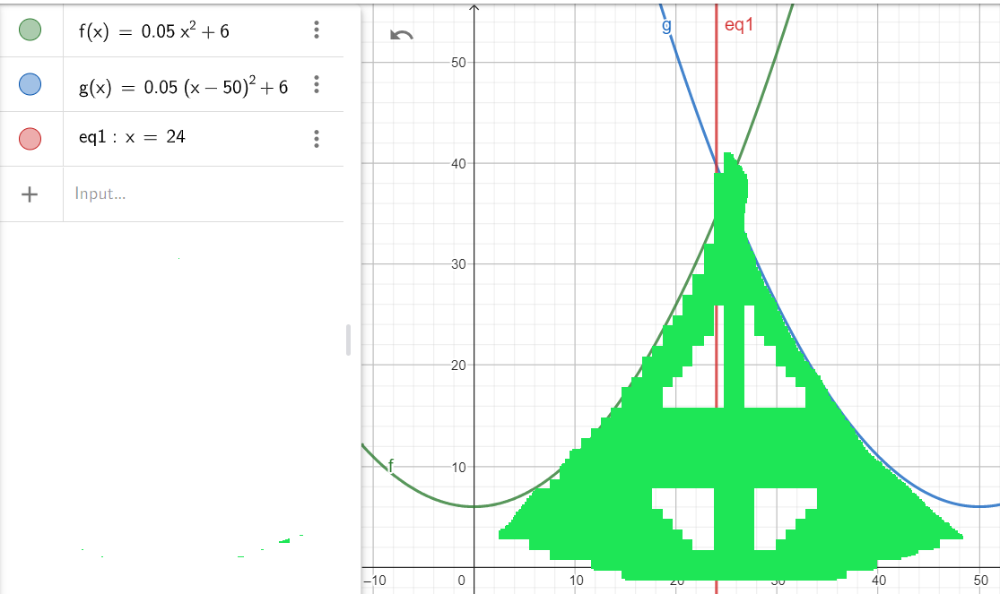

# Space Invaders
Space Invaders - классическая аркадная игра в жанре фиксированного шутера. На стрелки можно двигать пушку, стрелять, на кнопку esc можно выйти из игры в любое время, при этом рекорд (highscore) сохранится, нужно убить всех монтсров, пока они не добрались до пушки, избегая при этом их пули.
# Запуск Игры
Для запуска игры введите в терминал следующие команды:
```
git clone https://github.com/Ivans-sudo/Space-invaders.git
sudo apt install python3
sudo apt install python3-pygame
cd Space-invaders
git checkout dev
python3 run.py
```
# Как Играть:
- __Управление__
  Двигаться и стрелять в игре можно на стрелочки, из игры можно выйти, нажав клавишу esc.
- __Цель__
  Цель игры - набрать как можно больше очков, убивая монстров, пока они не дошли до пушки, или не попали по ней.\
  10 очков:
            
  
  15 очков:

  
  
  20 очков:

  
# Полное описание:
  На экране есть монстры, пушка , статистика, пули. Статика хранит количество оставихся пушек в виде картинок в левом верхнем углу (включая действующую), наивысший рекорд за всё время (highscore) и рекорд на данной попытке (score). Попыткой считается игра, в которой игрок не потратил все жизни, жизнь отнимается, если в игрока попадает пуля, при этом игра продолжается с этого же момента (как бы используется новая пушка), если же монстры дошли до пушки, то попытка заканчивается. Пушка, пули, вражеские пули и монстры - классы с функциями для отрисовки и обновления её позиции. Хитбокс пушки не квадратный, а упрощён двумя параболами, как показано на картинке ниже, хитбоксы монстров так же разные, пули могут столкнуться друг с другом, в таком случае они обе уничтожаются, так же пули удаляются, если выходят за пределы экрана, чтобы не забивать память. У монстров есть несколько видов, за разных видов монстров дают разное количество очков, монстры двигаются змейкой, как в оригинале. Монстры ускоряются по мере уменьшения их количества (как только кол-во монстров упало вдвое после предыдущего ускорения, они ускорятся в acceleretion раз), пули ускоряются пропорционально времени.
  
